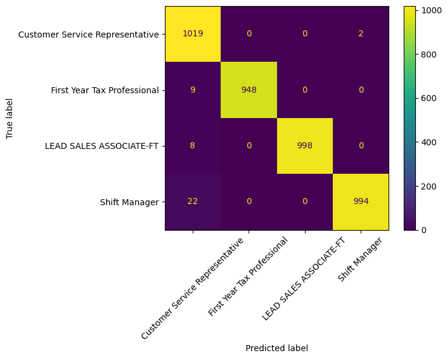

# **Co-Founder Matching Using Machine Learning**

## **1. Problem Statement**
The objective of this project is to develop a machine learning-based solution to match users on a co-founder matching platform. The goal is to predict successful matches by analyzing the relevant data and leveraging a classification model to suggest top potential co-founders based on specific job roles and skill requirements.

## **2. Introduction**
Matching platforms, especially for finding co-founders, need to efficiently match users based on their skills and the specific requirements of various roles. The challenge is to predict successful matches by analyzing job-related data, processing it, and applying a machine learning model to rank and recommend co-founders who best align with a given job title.

This project involves data collection, data processing, and building a classification model to predict potential co-founders based on their skills, using job titles as target variables.

## **3. Methodology**

### **Part 1: Data Collection and Analysis**
- **Data Source**: A dataset from Kaggle titled [1.3M LinkedIn Jobs and Skills (2024)](https://www.kaggle.com/datasets/asaniczka/1-3m-linkedin-jobs-and-skills-2024/data) is used, specifically the 'job_skills.csv' and 'linkedin_job_postings.csv' files.
- **Dataset Creation**:
  - The two datasets are merged on the 'job_link' field to create a unified dataset containing job titles and their associated skills.
  - The dataset is sampled for four job titles: 
    - LEAD SALES ASSOCIATE-FT
    - First Year Tax Professional
    - Shift Manager
    - Customer Service Representative
  - **Sample 1 (Training Data)**: 
    - 4,000 samples from each job title are used, resulting in a total of 16,000 samples. This dataset is used to train and test the classification model.
    
  - **Sample 2 (Co-Founder Database)**:
    - A separate, unseen dataset of 1000 samples per job title (totaling 4000 samples) is created. This is used to simulate a list of potential co-founders and their skills. Names are generated using Faker.
    
  
- **Data Processing**:
  - Rows with missing values and duplicates are removed.
  - Text preprocessing is applied to clean the job titles and skills, including the removal of special characters, numbers, and stopwords.

### **Part 2: Building the Matching Algorithm**
- **Model Choice**: Random Forest Classifier is used to classify job skills based on job titles.
- **Feature Representation**: Embeddings are generated using the [sentence-transformers/all-MiniLM-L6-v2](https://huggingface.co/sentence-transformers/all-MiniLM-L6-v2) model for better semantic representation of the text data.
- **Training**:
  - The model is trained using job skills as the input (independent variables) and job titles as the output (dependent variable).
  - The performance of the model is evaluated using metrics such as precision, recall, and F1-score.
  
- **Model Performance**:
  - The model achieved a high classification accuracy of 99%.
  - Classification Report:

    || precision | recall | f1-score | support|
    |---|---|---|---|---| 
    |Customer Service Representative |  0.96  | 1.00 | 0.98| 1021|
    |First Year Tax Professional | 1.00 | 0.99 | 1.00 | 957|
    |LEAD SALES ASSOCIATE-FT | 1.00 | 0.99 | 1.00  | 1006|
    |Shift Manager | 1.00 | 0.98 | 0.99 | 1016|

  - Confusion Matrix

    

- **Co-Founder Matching**:
  - The model is used to infer the predicted classes of potential co-founders in the separate dataset (Sample 2).
  - Co-founders are ranked based on their predicted probability scores for a given job title.
  - The final output is a list of top 'n' co-founders that best match the founder's specified job title.

- **4. Results**
    - The machine learning model demonstrated excellent performance in classifying job skills by job title, achieving a near-perfect accuracy of 99%.
    - The co-founder ranking system is successfully implemented by applying the trained classifier to an unseen dataset of potential co-founders, providing a ranked list of the best-suited candidates for a given job title.

## **4. Conclusion**
This project successfully developed a machine learning model that matches co-founders based on job roles and skills. The use of a RandomForestClassifier and sentence embeddings provided a robust approach to classify users' skills and predict the likelihood of a successful match. By ranking candidates based on predicted probabilities, the platform can offer more accurate and tailored co-founder suggestions, enhancing the user experience and increasing the chances of successful partnerships.

Future work:
- Expanding the dataset to include more diverse job titles
- Filtering co-founders based on location, experience level, etc.
- Refining the co-founder database
- Integrating feedback from real-world matches to continuously improve the matching algorithm.

---